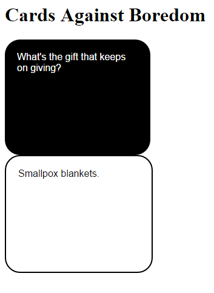

# Cards Against Boredom

This is a demo application I am playing with to learn [Ratpack](http://ratpack.io) development. It is a simple single-
page web application that provides a random set of black and white cards from the card game 
[Cards Against Humanity](http://cardsagainsthumanity.com). Sometimes it's amusing, sometimes it's dull, and sometimes
it's oddly accurate.

A live version of the application is deployed on a free-tier of [Heroku](http://heroku.com) at 
[https://cardsagainstboredom.herokuapp.com](https://cardsagainstboredom.herokuapp.com) - being that this is a free-tier
account, it may be down or slow to start up due to usage restrictions (be patient). What you will see, should look like
the following:

## Build

    ./gradlew clean build
    
## Running Locally

To run the server locally:

    ./gradlew run
    
or, with continuous reload (on change):
    
    ./gradlew -t run

## Attribution

The Cards Against Humanity card data was pulled from files provided on their web site:

* http://www.cardsagainsthumanity.com/bcards.txt 
* http://www.cardsagainsthumanity.com/bcards1.txt 
* http://www.cardsagainsthumanity.com/bcards2.txt

They provide their content under a Creative Commons license and I make no assertions that this content is mine, nor do 
I wish to present myself as having any direct association with the makers of the game. 